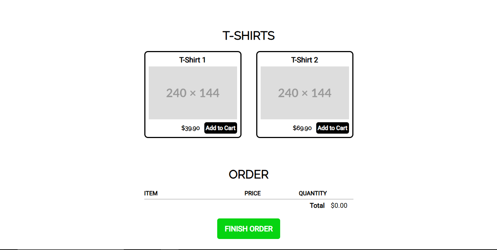

[JAVASCRIPT__BADGE]: https://img.shields.io/badge/Javascript-000?style=for-the-badge&logo=javascript
[HTML__BADGE]: https://img.shields.io/badge/html5-%23E34F26.svg?style=for-the-badge&logo=html5&logoColor=white
[CSS__BADGE]: https://img.shields.io/badge/css3-%231572B6.svg?style=for-the-badge&logo=css3&logoColor=white

<h1 align="center" style="font-weight: bold;">Carrinho - JavaScript 🛒</h1>

![javascript][JAVASCRIPT__BADGE]
![HTML5][HTML__BADGE]
![CSS3][CSS__BADGE]

<details open="open">
<summary>Table of Contents</summary>
 
- [📌 About](#about)
- [🚀 Getting started](#started)
  - [Cloning](#cloning)
- [📍 Application Routes](#pages)
- [🤝 How to reach me](#reach)
  
</details>


<p align="center">
    
</p>

<h2 id="about">📌 About</h2>

A JavaScript shopping cart with product addition, real-time updates, easy removal, automatic total calculation, and interactive checkout feedback.

<h2 id="started">🚀 Getting started</h2>

<h3>Cloning</h3>

```bash
git clone https://github.com/monosodrac/carrinho_js.git
```

<h2 id="pages">📍 Application Pages</h2>

| page               | description                                          
|----------------------|-----------------------------------------------------
| <kbd>Home</kbd>     | page that has date for presentations
| <kbd>Store</kbd>     | page to list products
| <kbd>About</kbd>     | page to detail of the page

<h2 id="reach">🤝 How to reach me</h2>

<table>
  <tr>
    <td align="center">
      <a href="https://linktr.ee/monosodrac">
        <br>
        <sub>
          <b>Mono</b>
        </sub>
      </a>
    </td>
  </tr>
</table>
